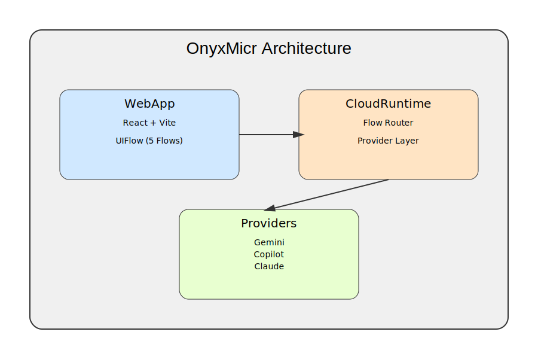

# OnyxMicr — Mobile Micro‑System  
A lightweight, modular, cloud‑connected micro‑workflow system designed for mobile-first document processing, translation, verification, and AI‑assisted micro‑automation.

Website: https://onyxmicr.vercel.app  
CloudRuntime: https://onyx-cloudruntime.vercel.app  

---

## 📦 Overview

**OnyxMicr** is a minimal, fast‑deployable micro‑system consisting of：

- **WebApp (React + Vite)** — Mobile‑first UI  
- **CloudRuntime (Vercel Serverless)** — Flow Router + Provider Layer  
- **Five Core Flows**  
  - Translate  
  - Scan (OCR)  
  - Process  
  - Sign  
  - Verify  

The system is designed for **rapid deployment**, **low maintenance**, and **AI‑assisted document workflows**.

---

## 🏗 System Architecture



---

## 📁 Repository Structure

```text
onyxmicr/
├── .github/workflows/        # GitHub Pages deployment
├── cloudruntime/             # Vercel Serverless API backend
│   └── api/runtime/cloud.js
├── webapp/                   # React + Vite frontend
│   ├── src/
│   │   ├── App.jsx
│   │   ├── main.jsx
│   │   └── pages/
│   │       ├── TranslateFlow.jsx
│   │       ├── ScanFlow.jsx
│   │       ├── ProcessFlow.jsx
│   │       ├── SignFlow.jsx
│   │       └── VerifyFlow.jsx
│   ├── index.html
│   ├── package.json
│   └── vite.config.js
├── LICENSE
└── README.md
